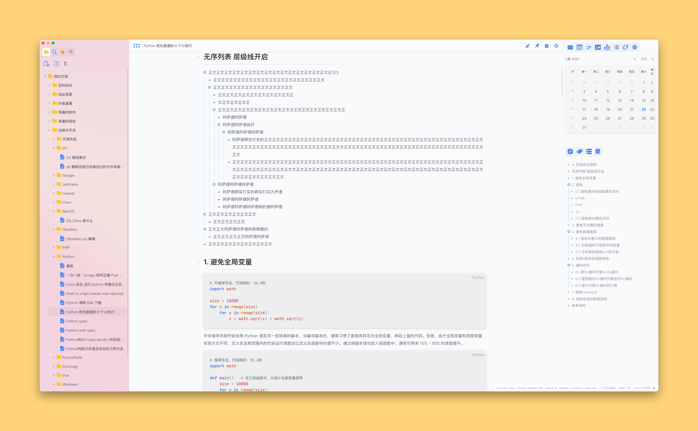
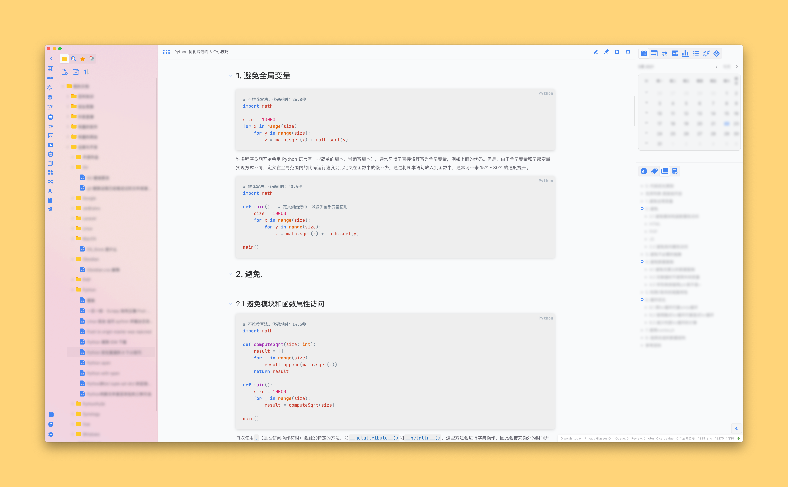
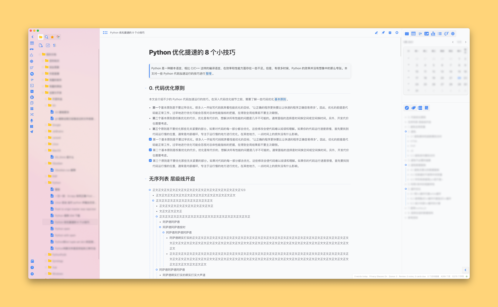
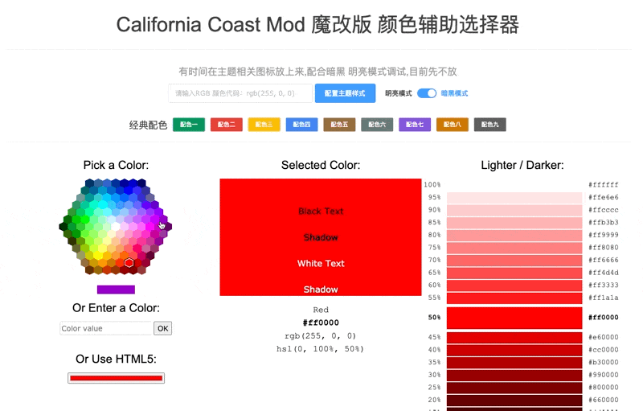
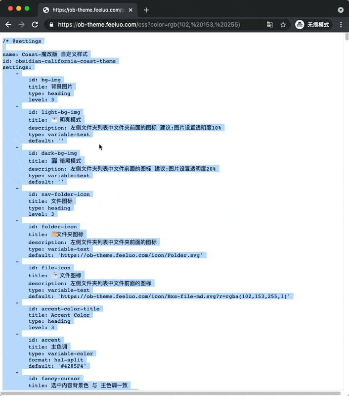

# California Coast 魔改版

## 简介
California Coast 是一款很棒的主题配色，本人很喜欢，但有些代码块配色不是很满意，就动手修改了一下，然后顺便其他样式也改了，慢慢就形成了目前的版本，想到不好的就会更新一下。

只是想把 `Obsidian` 作为一款得力助手，打造的漂亮点，用起来心情舒畅一些，毕竟要记录的东西那么多，每天都要看到，对吧。

##  主题截图

截图一

截图二

截图二

## 特性

- 全部 CSS 编写

## 推荐插件搭配

- Hider https://github.com/kepano/obsidian-hider
- Calendar https://github.com/liamcain/obsidian-calendar-plugin
- Advanced Tables https://github.com/tgrosinger/advanced-tables-obsidian
- Checklist https://github.com/delashum/obsidian-checklist-plugin
- 更多插件还在学习

## 配色器

> 配色器：https://ob-theme.feeluo.com/ 用了就会很喜欢的

选择自己喜欢的颜色，复制 `rgb` 颜色即可马上生成你想要的配色主题;

**操作步骤**

**复制 css**

## 图标来源

来自以下两个网站：

- https://www.iconfont.cn/
- https://iconify.design/

# 来源
原始地址：[obsidian-california-coast-theme](https://github.com/mgmeyers/obsidian-california-coast-theme)
